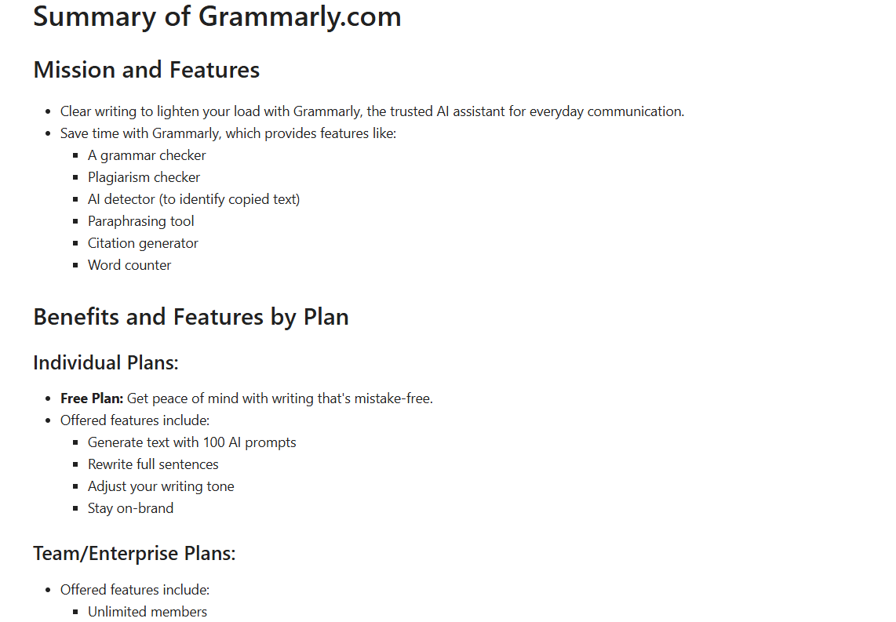

# Website Content Summarizer using LLaMA3

A Python tool that fetches and cleans webpage content, then uses a local LLaMA3 language model (via Ollama API) to generate concise markdown summaries - perfect for quick insights on any website.

---

## Features

- Fetches webpages with browser-like headers to avoid blocking  
- Removes irrelevant HTML elements (scripts, styles, images, inputs)  
- Extracts clean text content for summarization  
- Uses a local LLaMA3 model for generating markdown-formatted summaries  
- Easily customizable prompts for different summary styles  
- Integrated Jupyter display for rich markdown output  

---

## Requirements

- Python 3.8 or higher  
- `requests`  
- `beautifulsoup4`  
- `python-dotenv`  
- `openai` Python client configured for your local LLaMA3 endpoint  
- Jupyter Notebook or IPython environment (optional, for display)  

---

## Installation

1. **Clone the repository**

   ```bash
   git clone https://github.com/priyankamorajkar/web-summarizer.git
   cd website-summarizer
   ```
2. **Install dependencies**

    ```bash
    pip install -r requirements.txt
    ```

3. **Set up environment variables**
    
    Create a .env file with your API key or endpoint configuration.
    (optional if you set it directly in code)

---

## How It Works

- Fetches the webpage with proper user-agent headers.
- Parses and cleans the HTML to remove non-text elements.
- Extracts the main text content.
- Sends the cleaned content to the local LLaMA3 model with a system prompt to summarize.
- Returns and displays the summary in markdown format.



---

## Customization

- Modify the system_prompt variable to change the summary style or language.
- Adjust the headers to mimic different browsers if needed.
- Extend the Website class to extract other content types.

---

## Notes
- Requires a running local LLaMA3 model via Ollama API at http://localhost:11434.
- Internet access needed to fetch webpages unless running on local files.
- Designed for Jupyter, but can be adapted for CLI or web apps.

---

## License
This project is licensed under the MIT License.
